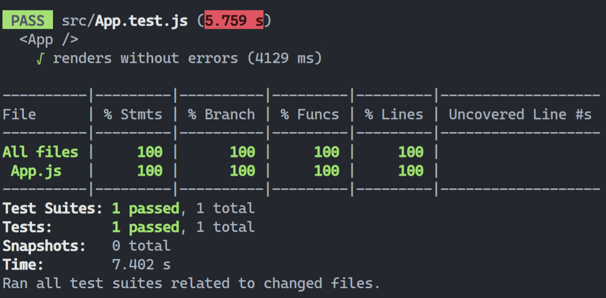

# Pragmateam code challenge client (React)

## ✨ Highlights
### 1. Step 1: modify `App.test.js` to test if it's displaying the status correctly, `*before*` touching the implementation code.

  (This is very important as the scenario states that we can't afford to break stuff.)

### 2. The coverage report varies depends on the run, as the data is random.
  
  
  
  (I got lucky to hit a 100% coverage, but usually it'd get at least 75% or more.)

### 3. I've consolidated 6 requests into one request, so that frontend only needs to call one endpoint
```
http://localhost:8081/temperature
```
### 4. The requests are sent in the Backend in parallel now. I refactor the code to `TemperatureService.cs`, so that both endpoints can use it. (the old endpoint stays as is, since I don't want to make any breaking changes.)

### 5. Dependency Injection in the Backend (nothing big, but it's just some good practices.)

## 🎨 What to improve if I've got more time?
### 1. Use `axios`, `react-query`

  a) The current way of sending requests is naive. It doesn't cancel a request in the useEffect tear down function. 

  b) When the component re-renders, the old request would try to modify the DOM which is unmounted.

  c) Also, there is one issue of race condition, it waits for 5s to send another round of requests, but the second round of requests could return the result first under some unstable network condition. 

### 2. I would consider `websocket` for in this case, as it sends requests quite frequently.

### 3. Add unit tests for `items[itemKey].temperature < items[itemKey].minimumTemperature`, there are 5 cases in total:
```
temperature < minimumTemperature
temperature = minimumTemperature
temperature > minimumTemperature && temperature > maximumTemperature
temperature = maximumTemperature
temperature > maximumTemperature
```

I didn't write them in this challenge, because I think having a end-to-end (the test I added) would give us confidence to refactor.

### 4. I didn't add Cypress tests in this challenge, but we could consider it in this product.
The reason why I didn't pick Cypress for now is that Cypress is not good at conditional testing, while our component has random data.
(we could mock the requests, though)


## 📄  Questions I would ask
### 1. Do we need to move the FE code to the BE?
```
const data = [
  {
    id: '1',
    name: 'Pilsner',
    minimumTemperature: 4,
    maximumTemperature: 6,
  },
```
I see it's hardcoded, but not sure in a real project if that's the case.

### 2. Not sure if I need to add tests in the BE, I don't see a lot if/else in the BE code. So I didn't add for now.

### 3. The BE code is not efficient. There is no bulk get endpoint. You have to call 
`https://temperature-sensor-service.herokuapp.com/sensor` a lot of times. Maybe that's something we can improve?